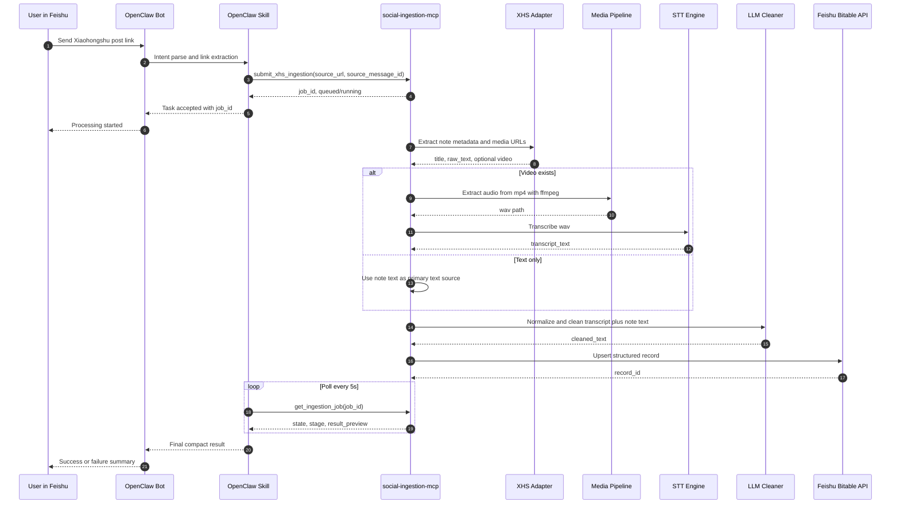
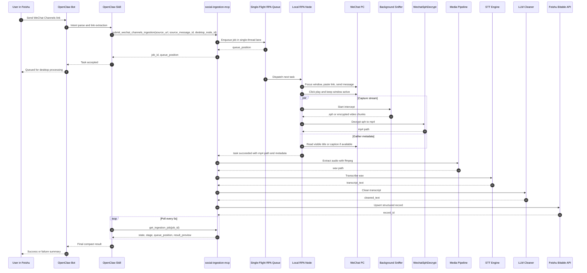

# Workflow Sequence Diagrams

## Workflow A: Xiaohongshu Silent Scraping Pipeline

## Workflow B: WeChat Channels RPA Pipeline

## Design Notes

- OpenClaw only submits and polls by job id.
- WeChat Channels always runs through a single-thread queue.
- Long transcript and cleaned正文 stay inside MCP and storage layers, not agent context.